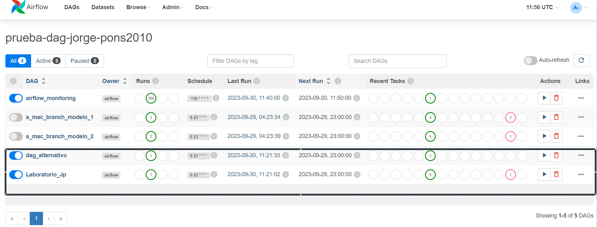

<em> # Orquestación de tareas con GCP </em>

Usando GCP voy a orquestar la ejecución de dos tareas con una programación diaria, dentro de estas tareas usaremos Xcom Push y pull, TriggerDagRunOperator y PythonOperator.

### Pasos Seguidos:

1. Creación entorno GCP.
2. Definición del proyecto.
3. Creación de scripts.
4. Subida a producción en GCP.
5. Puesta en producción.

### 1- Creación entorno GCP
Para la creación del entorno en GCP nos vamos a Composer y le damos a crear nuevo composer.
Rellenamos el tipo de entorno que queremos en este caso.

- Ubicación US-CENTRAL1.
- Imagen composer-1.20.12-airflow-2.4.3.
- 3 nodos 
- Tipo de máquina n1-standard-1.
- 30 GB de disco.
- Cuenta de servicio

### 2- Definición del proyecto
Creación de un flujo sencillo en el cual queremos incorporar los siguientes operadores.

- TriggerDagRunOperator.
- PythonOperator.
- EmptyOperator 
- XCOM.

### 3- Creación de scripts
El script principal se compone de la siguiente estructura.

- Importación librerías necesarias.
- Creación de funciones.
- Argumentos y creación del dag 
- Ejecución de tareas.
- Flujo de tareas.

### 4- Subida a producción en GCP.
Para la subida a prooducción nos vamos a al compositor, y vamos a la lista de dag. Una vez dentro pegamos los scripts.py creados y probados de manera local, una vez completada la subida del archivo y si no dá ningún problema la subida de se ha realizado con éxito. 

### 5- Puesta en producción.
Para la puesta en producción, partimos del apatado compositor de GCP, ahí pinchamos en el apartado de airflow. esto nos abre una ventana altenativa.
